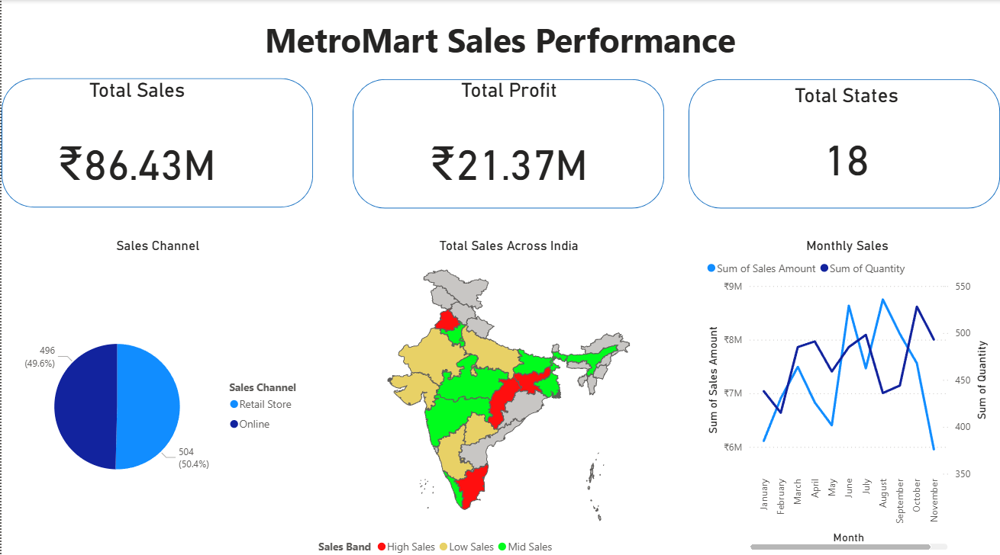
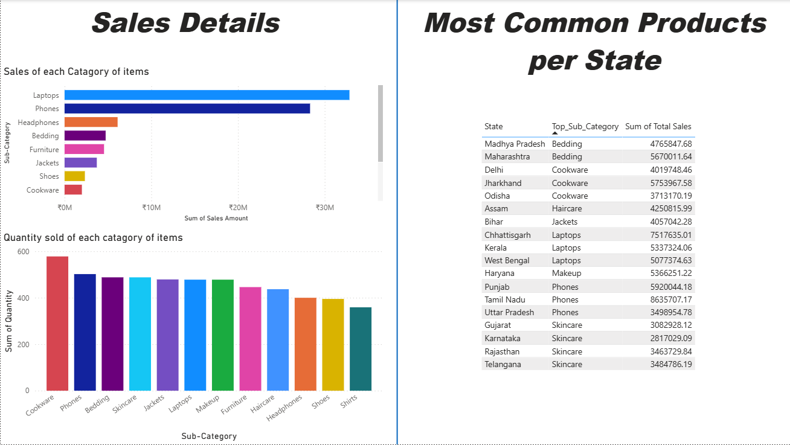

# 🛍️ MetroMart Sales Dashboard – Power BI

An interactive and data-rich Power BI dashboard built for **MetroMart**, a fictional hybrid retailer selling products both **online and offline across India**. This dashboard visualizes state-wise sales, profits, delivery metrics, shipping costs, and top-selling products using advanced DAX, geospatial mapping, and custom shape files.

---

## 📊 Key Features

### 🔹 Dashboard Overview
- 📌 **Total Sales**: ₹86.43M  
- 📌 **Total Profit**: ₹21.37M  
- 📌 **States Covered**: 18  
- 📌 **Channels**: Retail & Online  

### 🔹 Visuals Included:
- **Custom Shape Map (India)**: Color-coded by sales performance (High / Mid / Low)
- **Monthly Trend Line**: Sales vs Quantity across months
- **Sales Channel Breakdown**: Pie chart of order volume from online vs retail
- **Sub-Category Sales & Quantity**: Bar charts for sales and units sold by product type
- **Most Common Products per State**: Table showing dominant sub-category and total sales
- **Logistics Analysis**:
  - Average Delivery Time per State
  - Average Shipping Cost per State

---

## 📁 Files Included

| File Name                  | Description                                 |
|---------------------------|---------------------------------------------|
| `MetroMart_Dashboard.pbix` | Power BI dashboard project file             |
| `Sample_Data.xlsx`        | Sales dataset used for dashboard            |
| `in.json`                 | Custom TopoJSON file for India map          |
| `Screenshots/`            | Folder with dashboard preview images        |
| `README.md`               | Project documentation (this file)           |

---

## 🧠 Tools & Technologies

- **Power BI Desktop**
- **DAX** (for calculated columns and KPIs)
- **MapShaper** (to convert India shapefile to TopoJSON)
- **Excel** (data preprocessing)

---

## 🌍 Custom Geospatial Mapping

Used **TopoJSON file** (`in.json`) with India's state boundaries to create a **custom Shape Map** for statewise sales performance visualization. Sales bands were visually segmented into:
- 🔴 **High Sales**  
- 🟡 **Mid Sales**  
- 🟢 **Low Sales**

---

## 📷 Preview

### 🔸 Overview Page

### 🔸 Sales Details

### 🔸 Logistics Insights

---

## 🧾 What This Project Demonstrates

✔ Real-world data storytelling  
✔ Clean, responsive Power BI design  
✔ Use of custom visuals (TopoJSON mapping)  
✔ Practical DAX usage for grouping, KPIs, and segmentation  
✔ Insights into product performance and logistics challenges  

---
